# OceanWatchAI

[](../../actions/workflows/ci.yml)


OceanWatchAI is a C++20 maritime intelligence prototype that analyses AIS vessel trajectory data and produces explainable suspicious-behaviour risk reports relevant to illegal fishing detection.

The project focuses on transparent data engineering and deterministic scoring rather than black-box prediction. It ingests AIS CSV files, groups records into vessel tracks, computes movement features, evaluates rule-based risk indicators, optionally checks proximity to simple protected-area definitions, and writes CSV and Markdown reports suitable for review.

## Why This Matters

Illegal, unreported, and unregulated fishing damages marine ecosystems, undermines legitimate fishing economies, and makes enforcement harder for coastal authorities. AIS trajectory analysis cannot prove illegal activity on its own, but it can help triage vessels for further review by highlighting suspicious movement patterns such as long AIS gaps, slow repeated turning, unusual route behaviour, or activity near protected areas.

This project is intentionally scoped to AIS trajectory data. It does not process satellite imagery, radar, vessel registries, or enforcement intelligence.

## Project Highlights

- Modern C++20 codebase with CMake and Visual Studio support
- Robust AIS CSV loading with row-level warnings
- Vessel-track grouping and timestamp ordering
- Haversine distance, heading-change, elapsed-time, speed consistency, and acceleration utilities
- Feature extraction for low-speed behaviour, turning, AIS gaps, duration, and distance
- Transparent rule-based risk scoring with component explanations
- Lightweight z-score and median absolute deviation anomaly detection
- Simple circular protected-area proximity analysis
- CSV and GitHub-friendly Markdown report generation
- Catch2 unit tests covering parser, geospatial, feature, risk, anomaly, protected-area, and report logic

## Visual Overview

### End-to-End Workflow

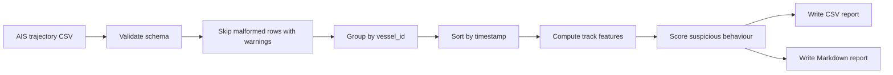

### Data Model

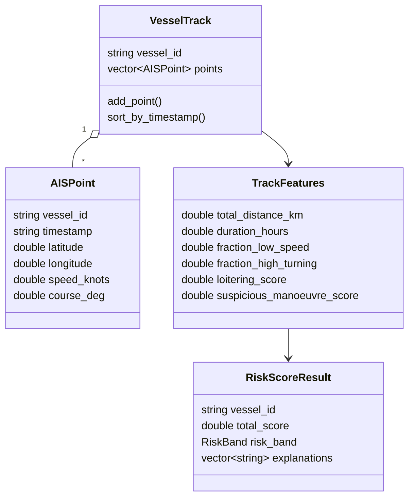

### Feature Engineering Map

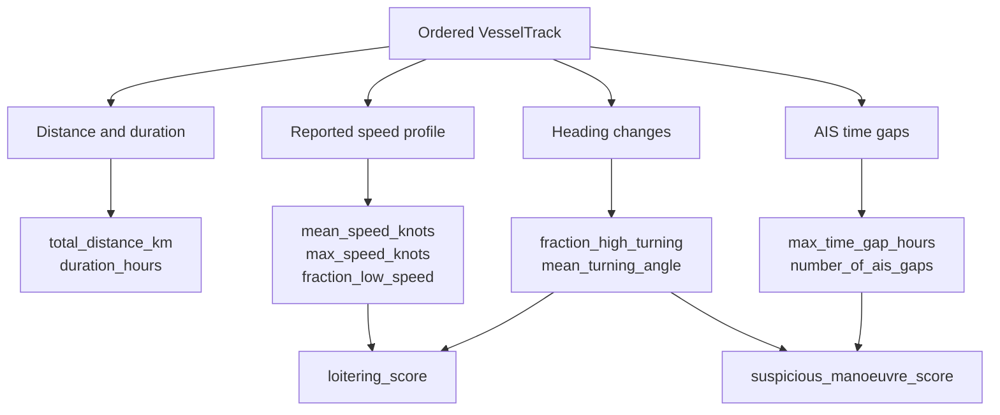

### Risk Scoring Weights

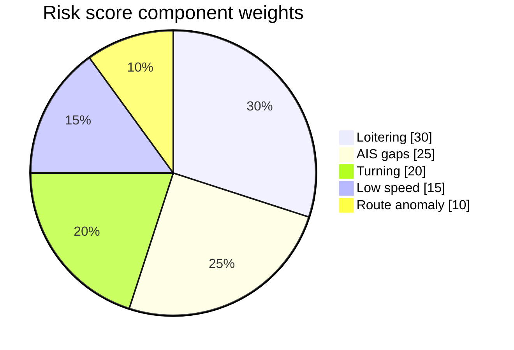

### Risk Band Thresholds

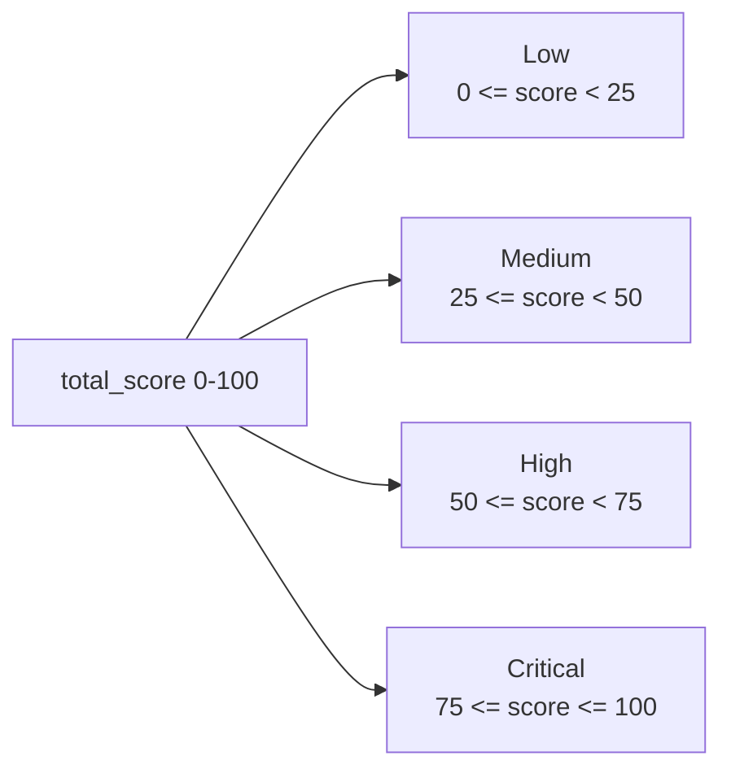

### Protected-Area Prototype

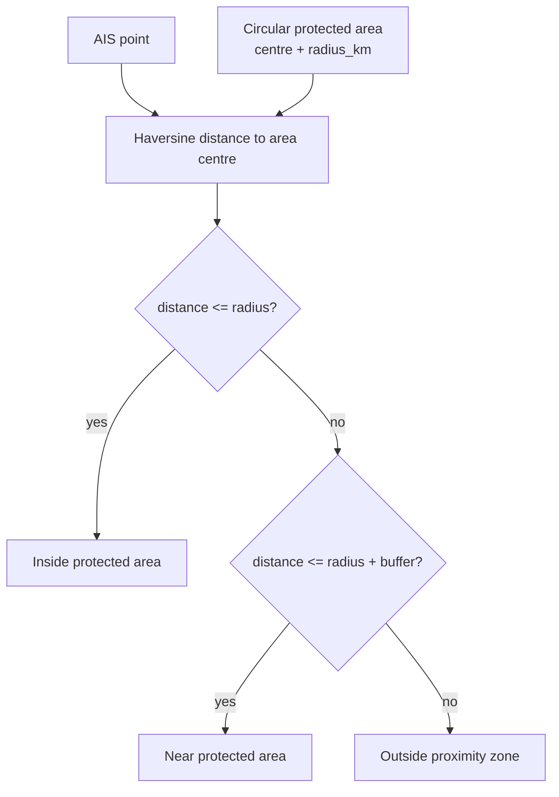

### CI And Test Coverage

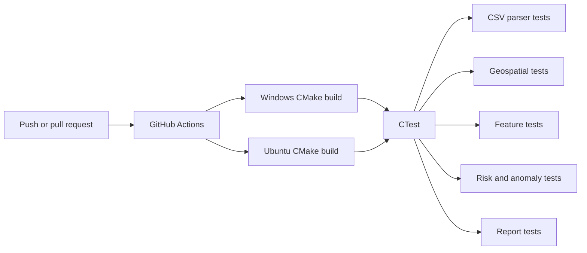

## System Architecture

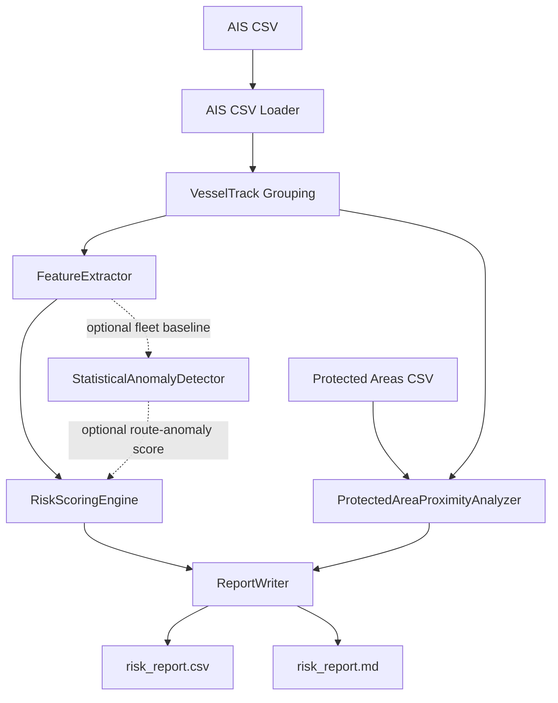

More detail: [docs/system_architecture.md](docs/system_architecture.md)

## Example Input

AIS input:

```csv
vessel_id,timestamp,latitude,longitude,speed_knots,course_deg
FV-OCEAN-001,2026-06-16T05:00:00Z,51.5120,1.4220,8.4,145.0
FV-OCEAN-001,2026-06-16T05:05:00Z,51.5065,1.4382,8.1,147.5
```

Protected-area input:

```csv
name,centre_latitude,centre_longitude,radius_km
Thames Estuary Conservation Zone,51.5200,1.4300,6.0
```

## Example Output

Compact CSV report:

```csv
vessel_id,total_score,risk_band,loitering_score,ais_gap_score,low_speed_score,turning_score,protected_area_score,anomaly_score
FV-OCEAN-002,15.000,Low,0.000,0.000,100.000,0.000,8.333,0.000
```

Markdown report sections:

- Summary
- Summary table
- Top suspicious vessels
- High-risk explanations
- Limitations

## Screenshots

The current project is a command-line prototype, so these are screenshot-style previews generated from the sample CLI workflow and report outputs. A future dashboard can replace or extend these with live map and analyst UI screenshots.

### CLI Run

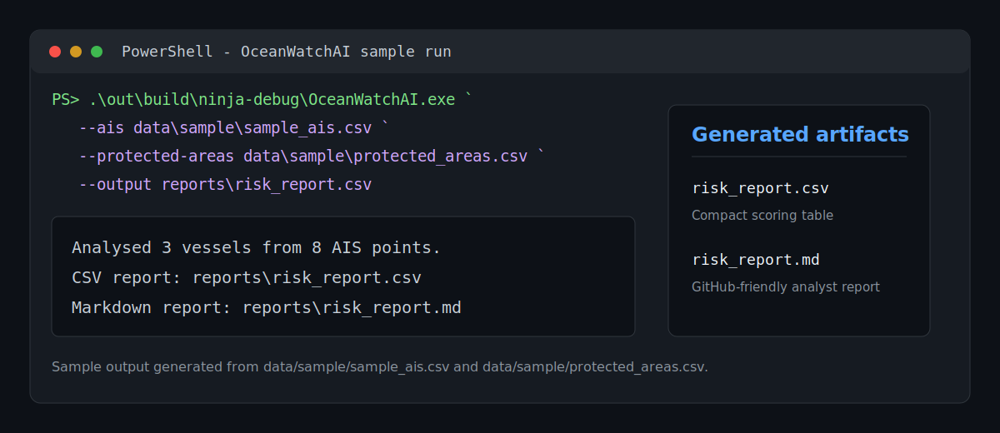

### CSV Report

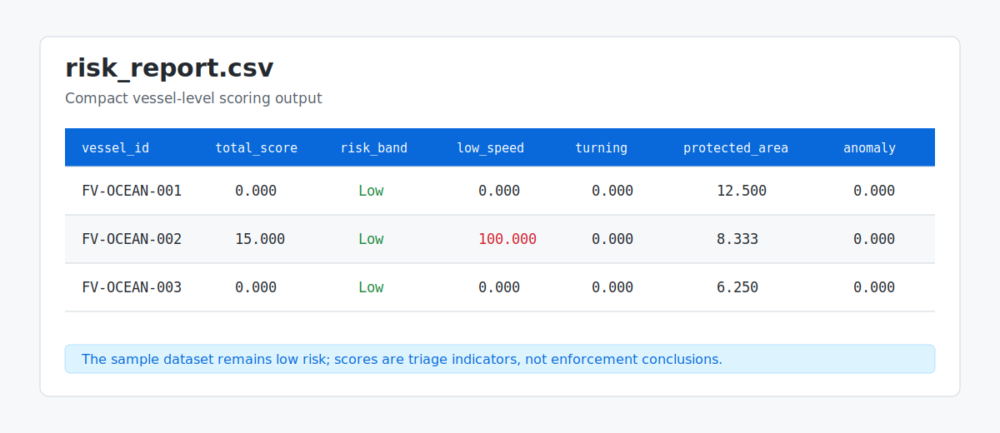

### Markdown Report

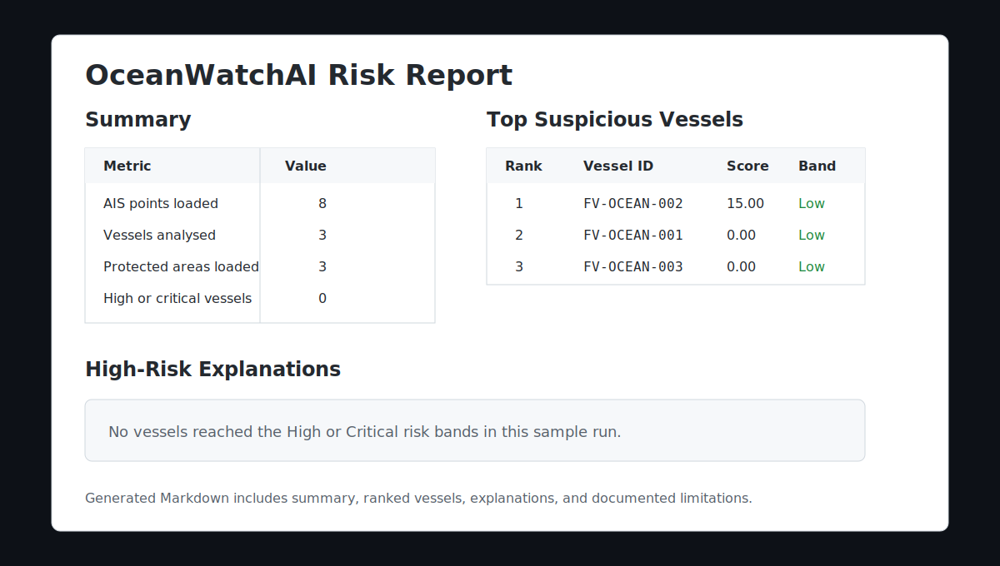

### Test Output

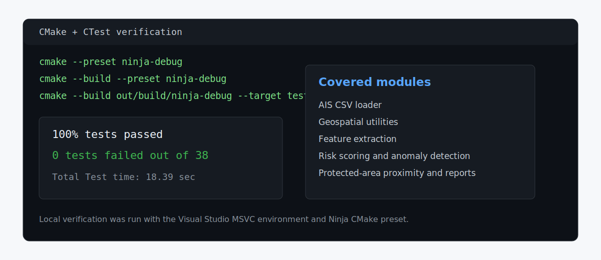

## Methods Used

- **AIS ingestion:** required-column validation, malformed-row warnings, grouping by vessel id
- **Geospatial analysis:** Haversine distance, angular difference, elapsed-time calculations
- **Feature engineering:** distance, duration, speed summaries, low-speed fraction, turning fraction, AIS gaps
- **Risk scoring:** deterministic weighted rule model with component scores and explanations
- **Statistical anomaly detection:** optional z-score and robust median absolute deviation against fleet baselines
- **Protected-area proximity:** simple circular area approximation with inside/near timing estimates
- **Testing:** focused Catch2 unit tests across data loading, math, features, scoring, reporting, and edge cases

## Why C++

C++ is a good fit for this prototype because maritime trajectory analysis can become compute-heavy as AIS volumes grow. C++20 provides strong type safety, deterministic performance, standard-library filesystem support, modern value semantics, and straightforward integration with production build systems such as CMake and Visual Studio. The project uses C++ in a deliberately readable style so the algorithms remain auditable.

## Documentation

- [System architecture](docs/system_architecture.md)
- [Geospatial methods](docs/geospatial_methods.md)
- [Risk model](docs/risk_model.md)
- [Testing strategy](docs/testing.md)
- [Future work](docs/future_work.md)
- [Contributing](CONTRIBUTING.md)
- [Changelog](CHANGELOG.md)

## Build

### Visual Studio

1. Open the `OceanWatchAI` folder in Visual Studio.
2. Select the `vs2022-debug` CMake preset.
3. Build the `OceanWatchAI` target or the full project.
4. Run tests from Test Explorer or by building/running `oceanwatchai_tests`.

### Command Line

```powershell
cmake --preset ninja-debug
cmake --build --preset ninja-debug
ctest --test-dir out/build/ninja-debug --output-on-failure
```

## Run

From the project root:

```powershell
.\out\build\ninja-debug\OceanWatchAI.exe `
  --ais data\sample\sample_ais.csv `
  --protected-areas data\sample\protected_areas.csv `
  --output reports\risk_report.csv
```

The command writes:

- `reports/risk_report.csv`
- `reports/risk_report.md`

To choose the Markdown path explicitly:

```powershell
.\out\build\ninja-debug\OceanWatchAI.exe `
  --ais data\sample\sample_ais.csv `
  --protected-areas data\sample\protected_areas.csv `
  --output reports\risk_report.csv `
  --markdown-output reports\risk_report.md
```

For help:

```powershell
.\out\build\ninja-debug\OceanWatchAI.exe --help
```

## Repository Structure

```text
src/             Implementation files and CLI entry point
include/         Public headers
tests/           Catch2 unit tests
data/sample/     Small AIS and protected-area CSV fixtures
docs/            Architecture and methods documentation
configs/         Placeholder for future runtime configuration
```

## Limitations

- AIS data can be missing, spoofed, delayed, or intentionally disabled.
- The current protected-area model uses circles, not legal polygon boundaries.
- The route anomaly component is a lightweight statistical/proxy signal, not a trained behavioural model.
- The CLI currently uses the default route-anomaly proxy; z-score/MAD anomaly scoring is available as a library module.
- The system does not use satellite imagery, radar, weather, ownership records, licensing records, or catch documentation.
- Risk scores are triage indicators for analyst review, not proof of illegal fishing.

## Future Work

- Polygon-based protected areas and maritime boundaries
- Larger AIS datasets and streaming ingestion
- Vessel-type-aware baselines
- More realistic route anomaly models
- Integration with known ports, fishing grounds, EEZs, and seasonal closures
- Report visualisations and map-based review UI
- Benchmarking and profiling on larger track volumes

See [docs/future_work.md](docs/future_work.md).
