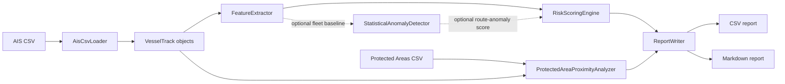

# System Architecture

OceanWatchAI is structured as a small C++20 analysis pipeline. The design keeps ingestion, feature engineering, scoring, protected-area proximity, anomaly detection, and reporting in separate modules so that each part can be tested and replaced independently.

## High-Level Flow



## Modules

`AisCsvLoader`

Loads AIS rows from CSV, validates required columns, skips malformed data rows with warnings, groups valid points by `vessel_id`, and returns timestamp-ordered `VesselTrack` objects.

`VesselTrack`

Owns ordered `AISPoint` records for a single vessel. Later analysis modules consume tracks rather than raw CSV rows.

`GeospatialUtils`

Provides Haversine distance, angular difference, timestamp difference, speed consistency, acceleration, and turning-angle utilities.

`FeatureExtractor`

Converts a `VesselTrack` into deterministic `TrackFeatures`, including distance, duration, speed summaries, turning behaviour, AIS gaps, and loitering signals.

`RiskScoringEngine`

Combines feature values into component scores and an explainable `0-100` risk score. The model is rule-based and deterministic.

`StatisticalAnomalyDetector`

Compares one vessel against a fleet baseline using either z-score or robust median absolute deviation. The resulting anomaly score can optionally feed the route-anomaly component. The command-line workflow currently uses the default route-anomaly proxy unless a future CLI option supplies a statistical baseline mode.

`ProtectedAreaProximityAnalyzer`

Checks points and tracks against simple circular protected areas. It estimates time inside and near protected areas and generates proximity explanations.

`ReportWriter`

Writes compact CSV output and GitHub-friendly Markdown reports.

## Data Contracts

AIS input columns:

```text
vessel_id,timestamp,latitude,longitude,speed_knots,course_deg
```

Protected-area input columns:

```text
name,centre_latitude,centre_longitude,radius_km
```

## Design Choices

- Keep each analytical stage independently testable.
- Prefer deterministic, explainable methods over opaque scoring.
- Treat AIS row errors as recoverable warnings when possible.
- Treat malformed reference data, such as protected-area definitions, as fatal.
- Use simple models first, with clear documentation of limitations.

## Current Boundaries

The system analyses AIS trajectory data only. It does not currently ingest satellite imagery, radar, licensing records, vessel ownership data, catch documentation, or port-state-control data.
